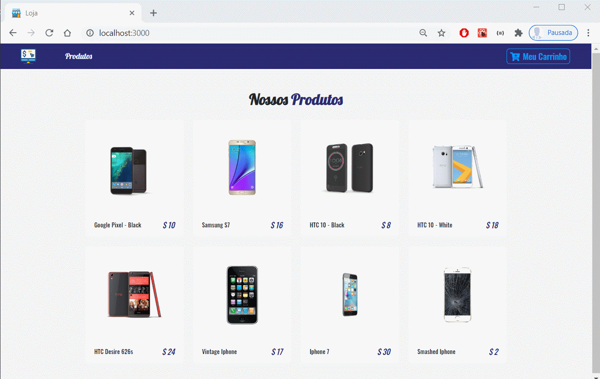

<h1 align="center">React Phone Store</h1>

 
   

<h2>💻 Live Example </h2>

[React Phone Store](https://react-phone-loja.netlify.app/)

------------

<h2>📖 Sobre</h2>

 Ecommerce de smartphones online.

------------

<h2>🚀 Tecnologias</h2>

Este projeto foi desenvolvido com as seguintes tecnologias:
- [NodeJS](https://nodejs.org/en/ "NodeJs")
- [React](https://reactjs.org/ "React")
- [Bootstrap](https://getbootstrap.com/ "Bootstrap")
- [Styled Components](https://styled-components.com/ "Styled Components")
  

------------

<h2>♻️ Como Contribuir</h2>

- Fork este repositório;

- Crie uma branch com a sua feature: `git checkout -b my-feature`

- Commit suas mudanças: `git commit -m 'feat: My new feature'`

- Push a sua branch: `git push origin my-feature`

------------

<h2>🎓 Quem ministrou?</h2>
Foi ministrado por <a href="https://www.johnsmilga.com/">John Smilga</a>.

------------

<h2>📃Licença</h2>

Este projeto está sobre a Licença do MIT. Acesse a <a href="https://github.com/Nandosbx/react-phone-store/blob/master/LICENSE.md">Licença</a> e saiba mais.

------------

<footer align="center">
 <strong align="center">Made with 💜 by Fernando Batista</strong>
</footer>

